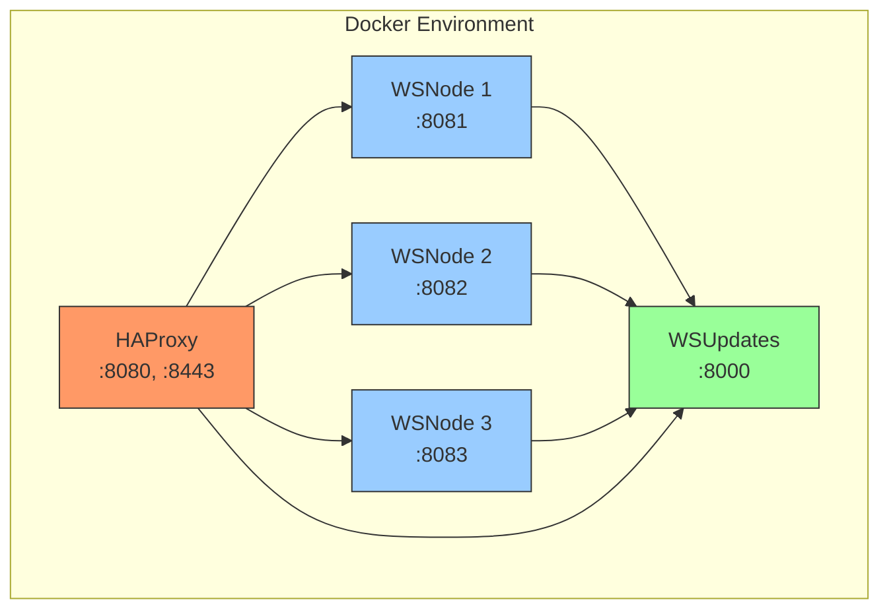

# Docker Deployment Guide

This guide explains how to deploy the WebSocket Management System using Docker.

## Prerequisites

- Docker Desktop
- Docker Compose
- WSL2 (for Windows users)

## System Components

The system consists of the following Docker containers:



### 1. HAProxy (Load Balancer)
- Port: 8080 (HTTP), 8443 (HTTPS)
- SSL termination
- WebSocket load balancing
- Health checks

### 2. WSUpdates (Configuration Service)
- Port: 8000
- SQLite database
- Node registry
- Channel configuration

### 3. WSNodes (WebSocket Servers)
- Ports: 8081, 8082, 8083
- Scalable WebSocket nodes
- Inter-node communication
- Metrics reporting

## Quick Start

1. Start Docker Desktop
```bash
# Windows users: Launch Docker Desktop application
# Linux users: Start Docker service
sudo systemctl start docker
```

2. Clone the repository
```bash
git clone <repository-url>
cd WebSocketManagement
```

3. Build and start the services
```bash
docker-compose up --build -d
```

4. Verify the deployment
```bash
docker-compose ps
```

## Environment Variables

### HAProxy
- No environment variables required
- Configuration in `haproxy/haproxy.cfg`

### WSUpdates
```env
DB_PATH=/data/ws.db
API_KEY=your_api_key
```

### WSNode
```env
NODE_ID=unique_node_id
PORT=node_port
WS_UPDATES_URL=http://wsupdates:80
API_KEY=your_api_key
```

## Volume Management

The system uses the following Docker volumes:

- `ws_data`: Persistent storage for SQLite database
  ```bash
  # View volume contents
  docker volume inspect ws_data
  ```

## Network Configuration

All services are connected through the `ws_network` bridge network:
```bash
# Inspect network
docker network inspect ws_network
```

## Health Checks

Monitor the health of your services:
```bash
# Check HAProxy stats
curl http://localhost:8080/stats

# Check WSUpdates health
curl http://localhost:8000/health

# Check WSNode health (repeat for each node)
curl http://localhost:8081/health
```

## Scaling

To scale WSNodes horizontally:
```bash
# Add more nodes
docker-compose up -d --scale wsnode=5

# Note: Manual HAProxy configuration update required
```

## Logs

View container logs:
```bash
# All services
docker-compose logs

# Specific service
docker-compose logs wsnode1
```

## Troubleshooting

1. **Container won't start**
   ```bash
   # Check logs
   docker-compose logs <service_name>
   ```

2. **Network connectivity issues**
   ```bash
   # Verify network
   docker network ls
   docker network inspect ws_network
   ```

3. **Database issues**
   ```bash
   # Check volume
   docker volume inspect ws_data
   ```

## Maintenance

### Backup
```bash
# Backup SQLite database
docker-compose exec wsupdates tar czf /backup.tar.gz /data/ws.db
docker cp $(docker-compose ps -q wsupdates):/backup.tar.gz ./backup.tar.gz
```

### Updates
```bash
# Update all services
docker-compose pull
docker-compose up -d

# Update specific service
docker-compose up -d --no-deps --build <service_name>
```

### Cleanup
```bash
# Stop all services
docker-compose down

# Remove volumes
docker-compose down -v

# Remove unused images
docker image prune
```

## Security Considerations

1. **API Keys**
   - Use strong, unique API keys
   - Rotate keys regularly
   - Never commit keys to version control

2. **SSL/TLS**
   - Configure SSL certificates in HAProxy
   - Use secure protocols (TLS 1.2+)
   - Regular certificate renewal

3. **Network Security**
   - Internal services not exposed to internet
   - Regular security updates
   - Monitor logs for suspicious activity

## Development Workflow

1. **Local Testing**
   ```bash
   # Start with development configuration
   docker-compose -f docker-compose.yml -f docker-compose.dev.yml up
   ```

2. **Code Changes**
   ```bash
   # Rebuild affected services
   docker-compose up -d --no-deps --build <service_name>
   ```

3. **Debug Mode**
   ```bash
   # Start with debug ports exposed
   docker-compose -f docker-compose.yml -f docker-compose.debug.yml up
   ```
