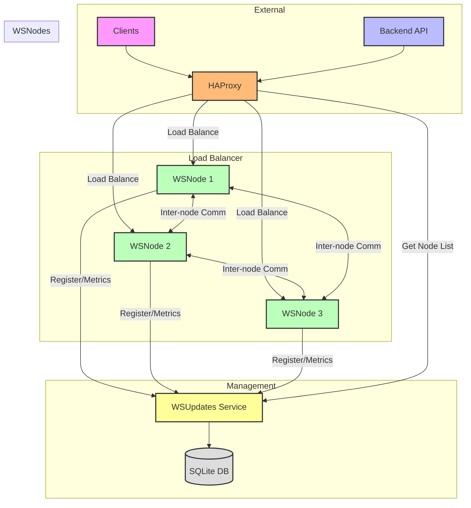
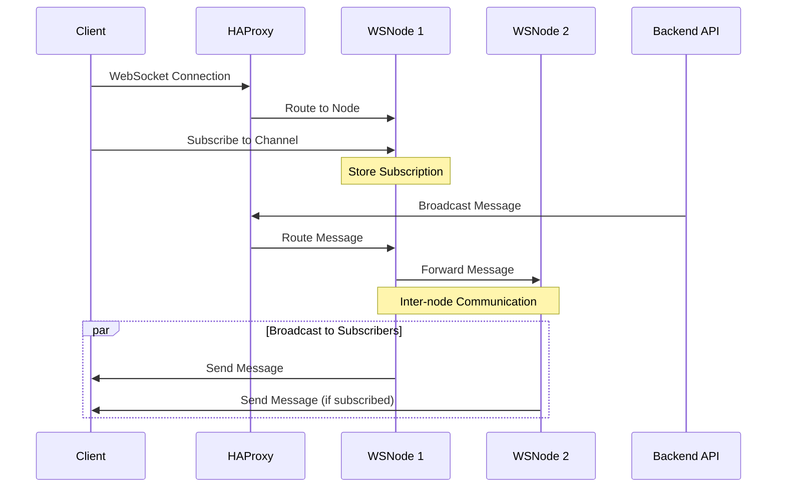
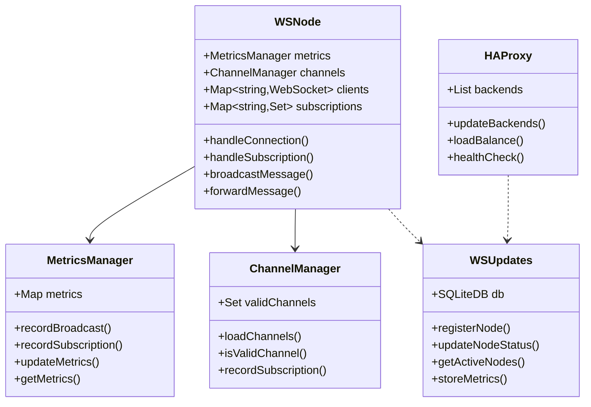
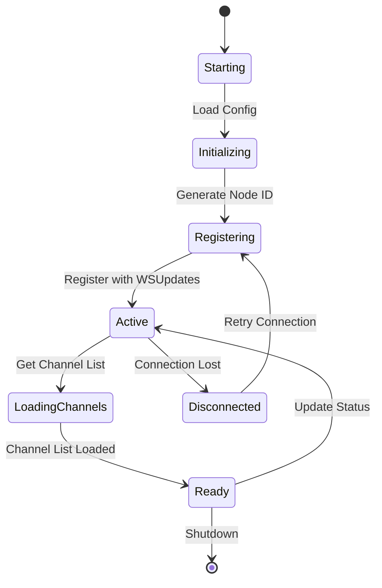
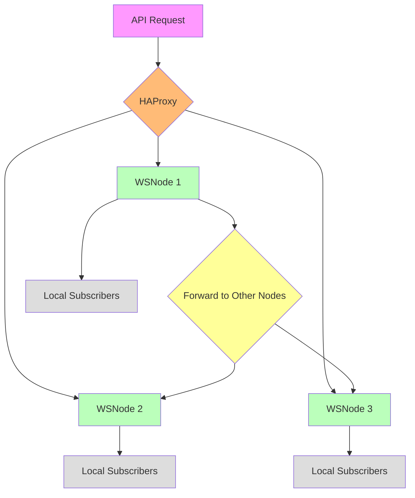
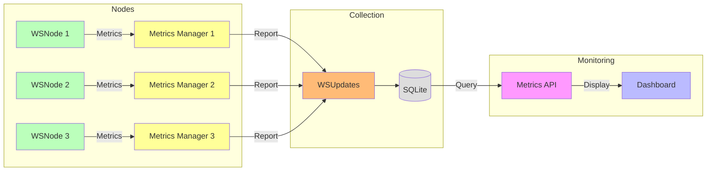

# Distributed WebSocket Management System

A scalable, distributed WebSocket server management system that enables load balancing and seamless message broadcasting across multiple WebSocket nodes without centralized message brokers.

## System Architecture

## Message Flow

## Component Structure

## Node Discovery Process

## Broadcast Message Flow

## Metrics Collection

## Development Guidelines

- All code and comments in English
- Clean, modular code structure
- Environment-specific configurations
- Docker-first deployment approach
- Comprehensive logging and monitoring

## Component Details

### HAProxy Configuration
- Sticky sessions enabled
- Health checking
- SSL termination
- Dynamic backend updates
- Configuration update script

### WSNode
- Dockerized NodeJS application
- Configurable ports and settings
- Unique node identification
- Inter-node communication
- Metrics and monitoring
- Channel subscription management

### WSUpdates
- PHP/SQLite based service
- Node registry management
- Channel configuration
- Security and authentication
- API documentation

## Getting Started

1. Clone the repository
2. Set up WSUpdates service
3. Configure and start HAProxy
4. Deploy WSNodes
5. Configure environment variables
6. Test the setup

## Monitoring and Maintenance

- Node health checks
- Connection metrics
- Message throughput
- System resources
- Error logging

## License

MIT License

## Contributing

1. Fork the repository
2. Create feature branch
3. Submit pull request
4. Follow code guidelines
