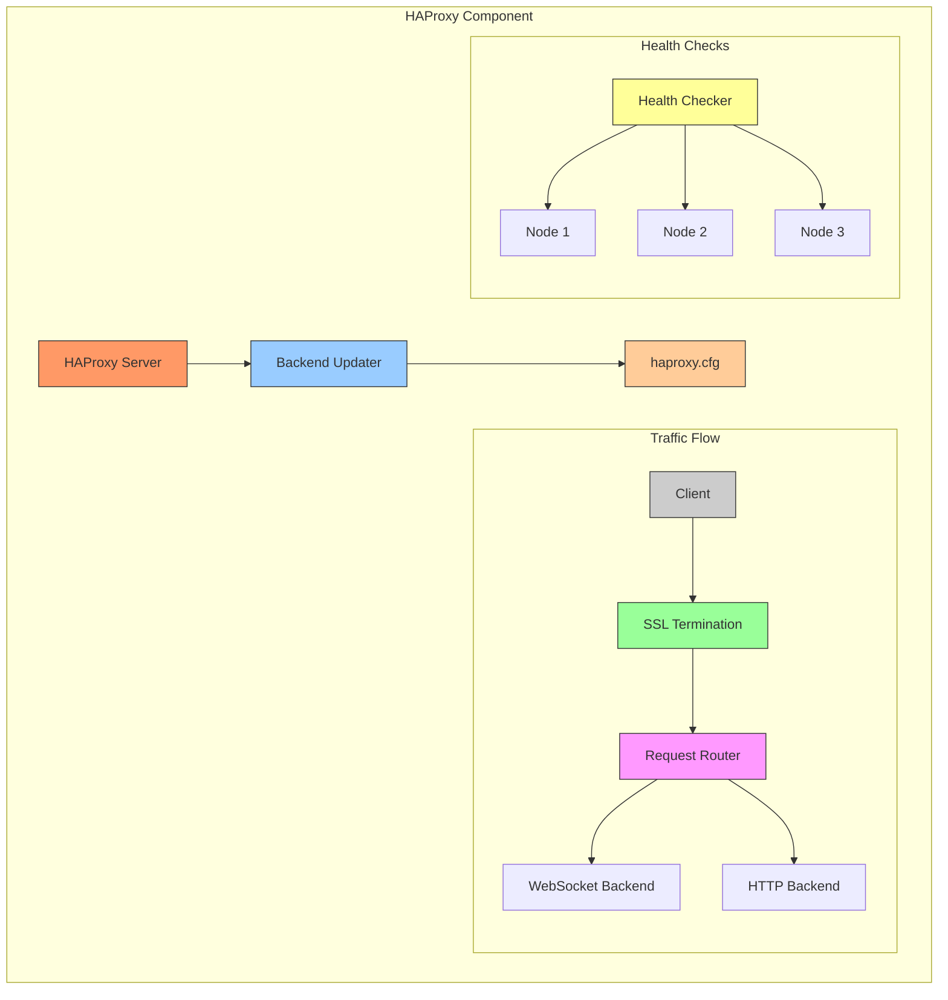
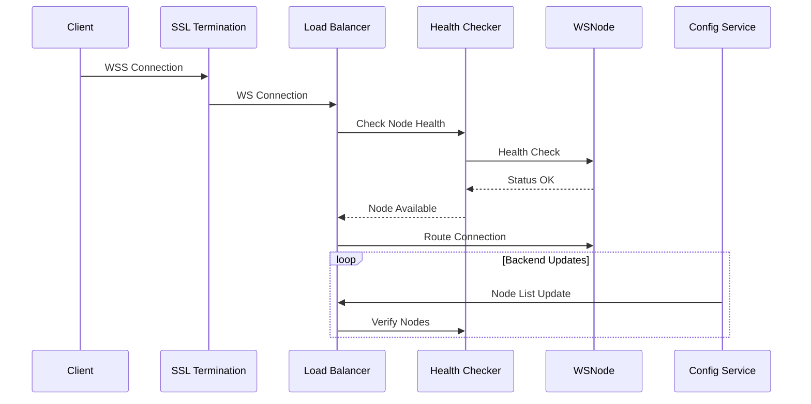
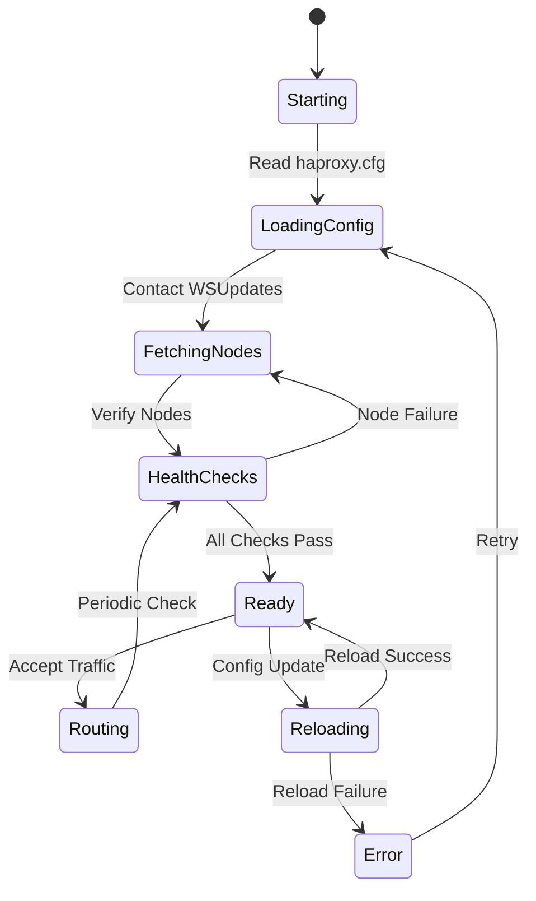
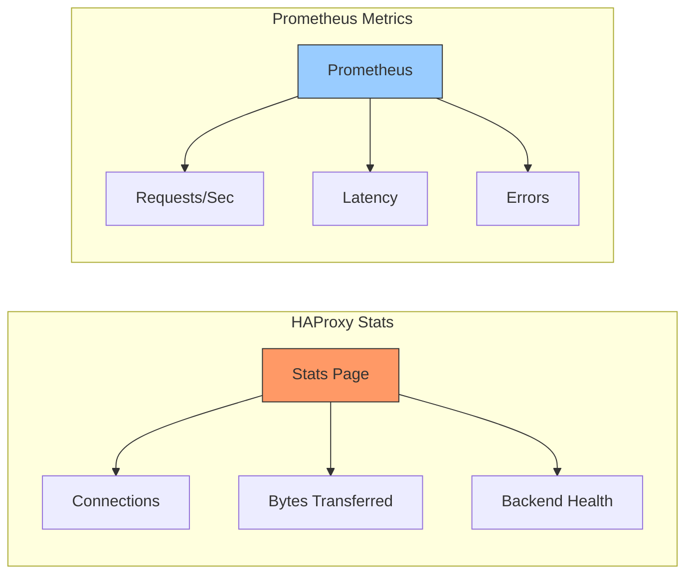
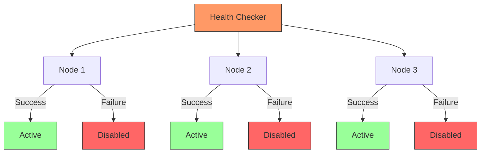

# HAProxy Load Balancer Component

HAProxy component handles load balancing and routing for the WebSocket Management System.

## Architecture



## Component Flow



## Configuration Flow



## Directory Structure

```
haproxy/
├── Dockerfile           # HAProxy container configuration
├── haproxy.cfg         # Main HAProxy configuration
├── update_backends.py  # Dynamic backend updater
└── certs/             # SSL certificates (optional)
```

## Configuration Parameters

### HAProxy Configuration

```conf
# Frontend settings
frontend http-in
    bind *:8080
    bind *:8443 ssl crt /certs/cert.pem

# Backend settings
backend ws_backend
    balance roundrobin
    option http-server-close
    option forwardfor
```

### Environment Variables

| Variable | Description | Default |
|----------|-------------|---------|
| WS_UPDATES_URL | WSUpdates service URL | - |
| API_KEY | Authentication key | - |
| UPDATE_INTERVAL | Backend update interval | 30s |

## Metrics and Monitoring



## Health Check System



## Security Considerations

1. SSL/TLS Configuration
2. Access Control
3. Rate Limiting
4. DDoS Protection

## Troubleshooting

1. Check HAProxy status
```bash
docker-compose exec haproxy haproxy -c -f /usr/local/etc/haproxy/haproxy.cfg
```

2. View logs
```bash
docker-compose logs -f haproxy
```

3. Monitor statistics
```bash
curl http://localhost:8080/stats
```
