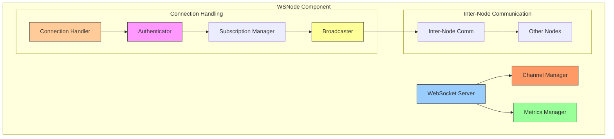
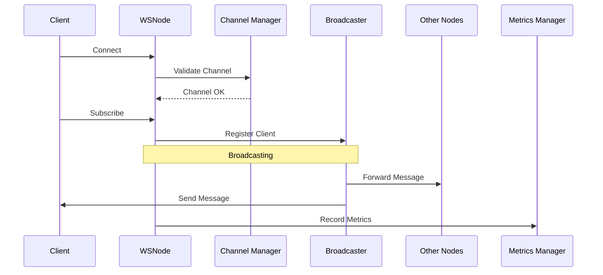
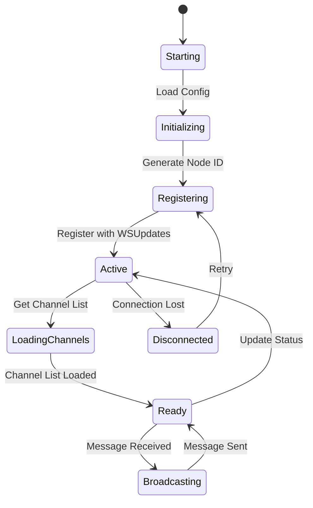
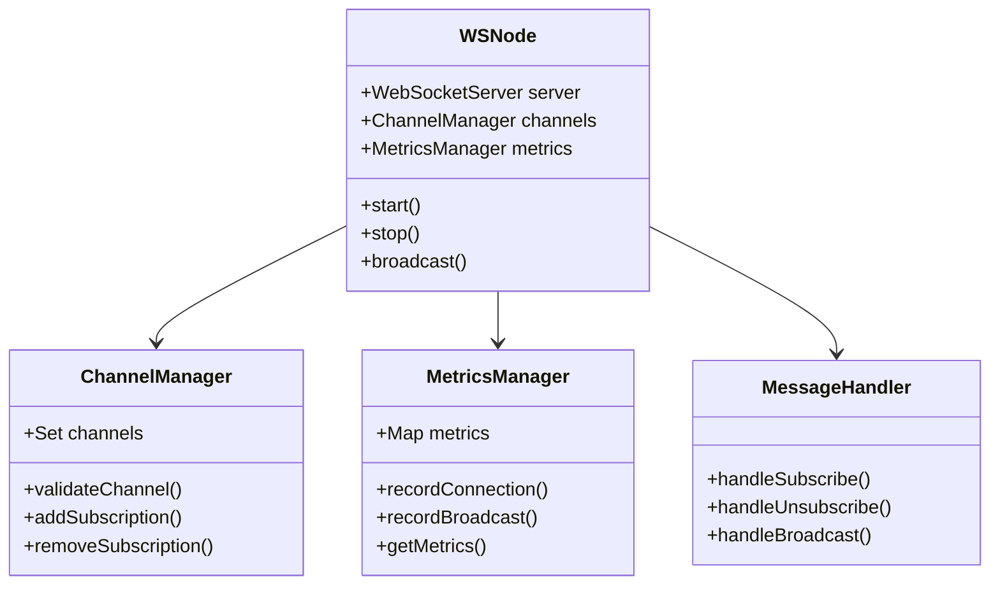
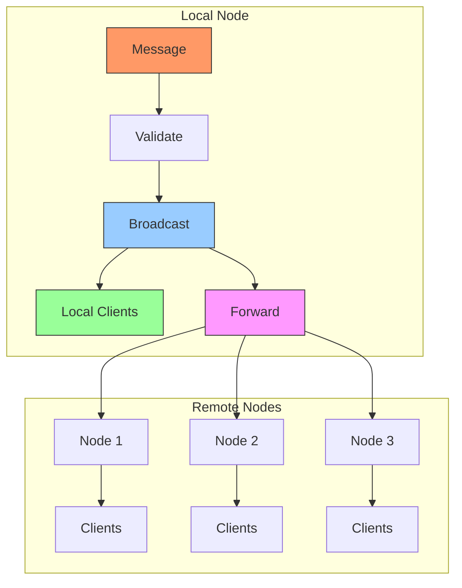
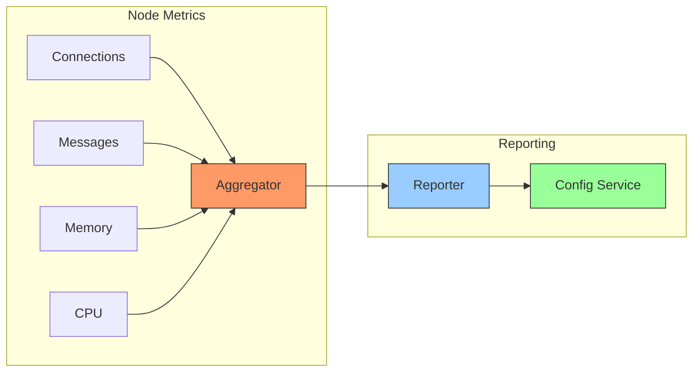

# WebSocket Node Component

WSNode is a Node.js-based WebSocket server that handles client connections and message broadcasting.

## Architecture



## Message Flow



## Component State Machine



## Directory Structure

```
wsnode/
├── src/
│   ├── server.js          # Main WebSocket server
│   ├── channelManager.js  # Channel management
│   ├── metricsManager.js # Metrics collection
│   └── utils/            # Utility functions
├── Dockerfile            # Container configuration
└── package.json         # Dependencies
```

## Class Diagram



## Message Broadcasting



## Metrics Collection



## Configuration

### Environment Variables

| Variable | Description | Default |
|----------|-------------|---------|
| NODE_ID | Unique node identifier | auto-generated |
| PORT | WebSocket server port | 8081 |
| WS_UPDATES_URL | Config service URL | - |
| API_KEY | Authentication key | - |

## API Endpoints

1. WebSocket: `ws://hostname:port`
2. Health: `GET /health`
3. Metrics: `GET /metrics`

## Security

1. API Key Authentication
2. Channel Access Control
3. Rate Limiting
4. Connection Validation

## Troubleshooting

1. Check logs
```bash
docker-compose logs -f wsnode
```

2. Monitor metrics
```bash
curl http://localhost:8081/metrics
```

3. Verify node registration
```bash
curl http://localhost:8081/health
```
