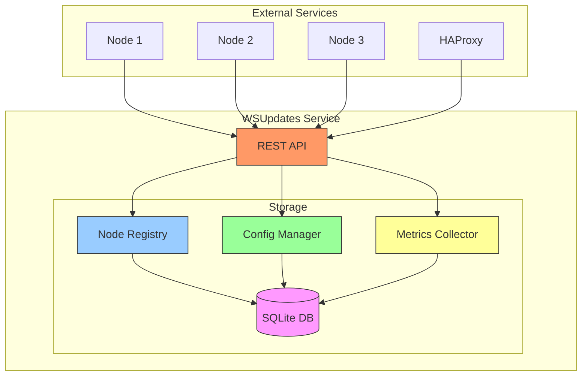
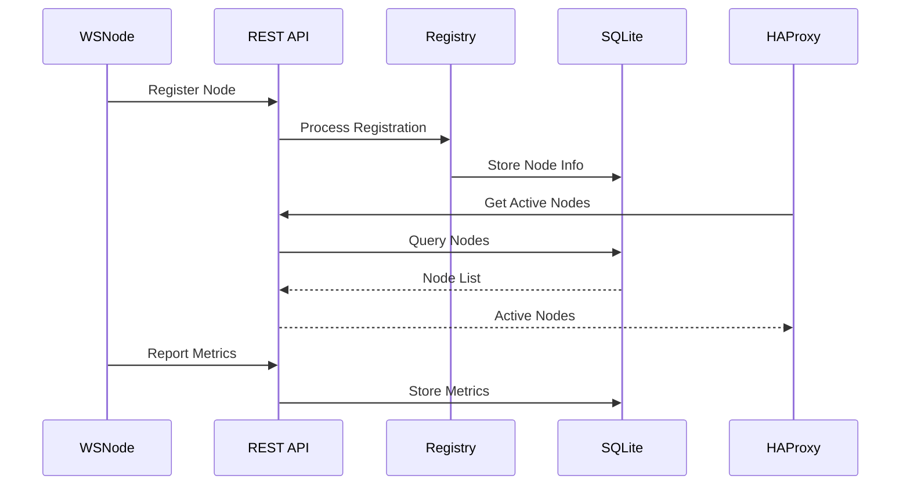
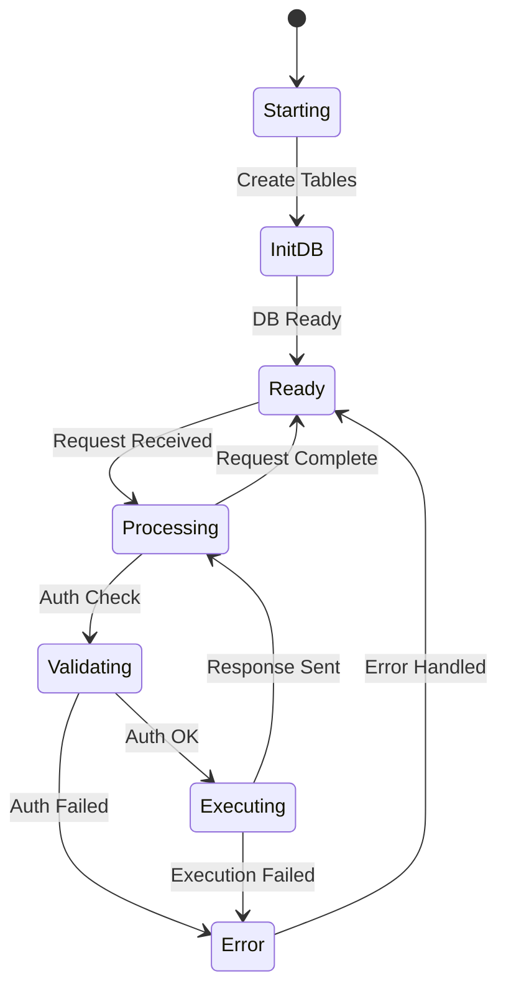
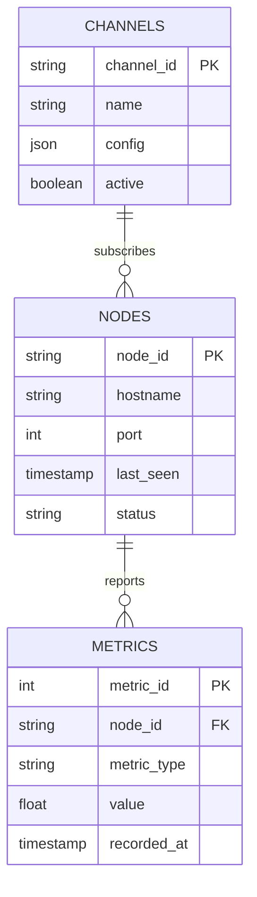
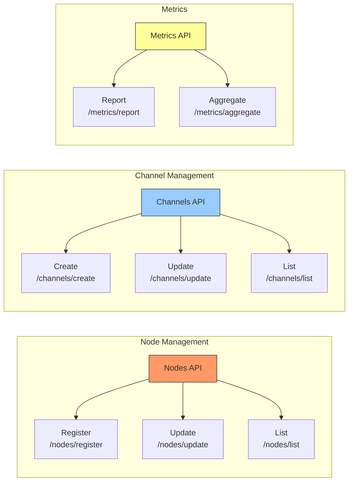
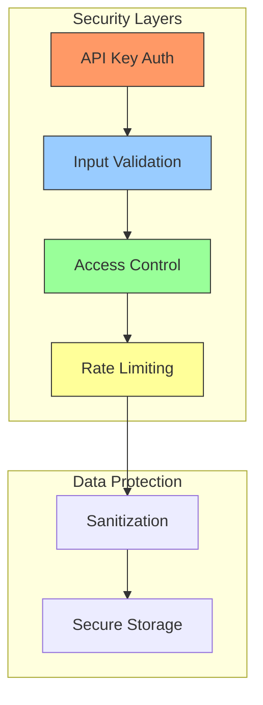
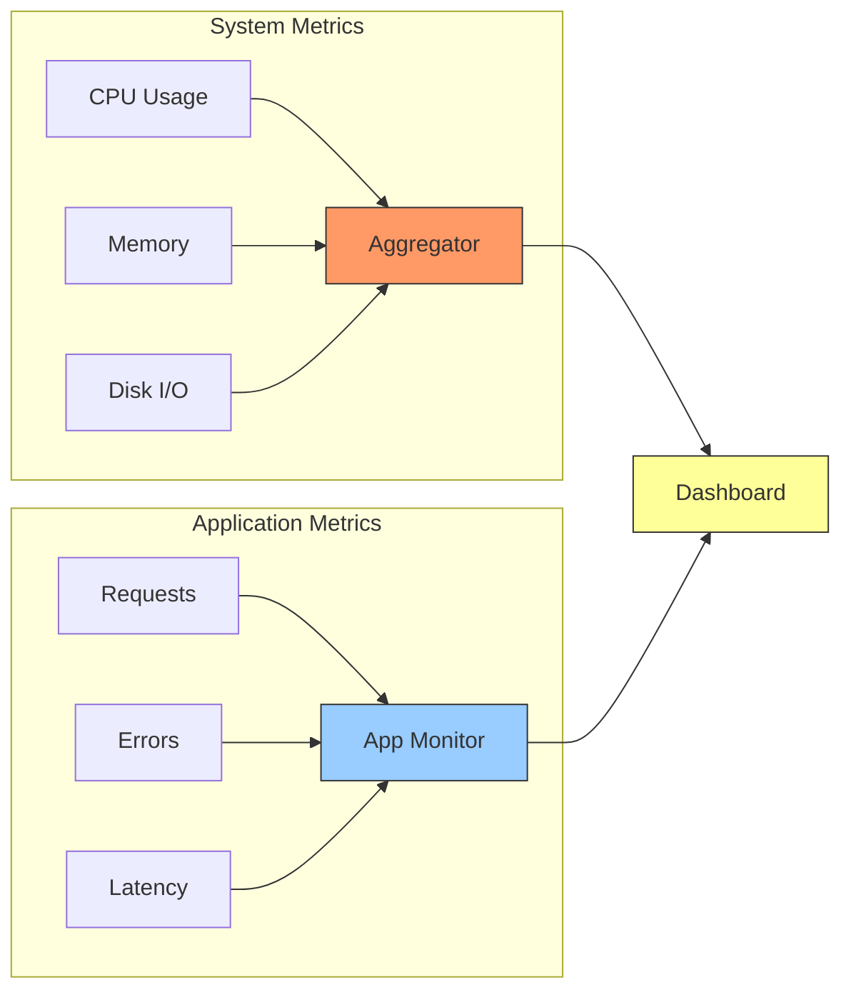

# WSUpdates Configuration Service

WSUpdates is a PHP-based configuration service that manages node registry and channel configurations for the WebSocket Management System.

## Architecture



## Data Flow



## Component States



## Database Schema



## API Structure



## Directory Structure

```
wsupdates/
├── src/
│   ├── index.php        # Main application
│   ├── config/          # Configuration
│   ├── controllers/     # Request handlers
│   └── models/          # Data models
├── Dockerfile          # Container configuration
└── composer.json      # Dependencies
```

## Configuration

### Environment Variables

| Variable | Description | Default |
|----------|-------------|---------|
| DB_PATH | SQLite database path | /data/ws.db |
| API_KEY | Authentication key | - |

## API Endpoints

### Node Management
- `POST /nodes/register` - Register new node
- `PUT /nodes/update` - Update node status
- `GET /nodes/list` - List active nodes

### Channel Management
- `POST /channels/create` - Create channel
- `PUT /channels/update` - Update channel
- `GET /channels/list` - List channels

### Metrics
- `POST /metrics/report` - Report node metrics
- `GET /metrics/aggregate` - Get aggregated metrics

## Security



## Monitoring



## Troubleshooting

1. Check logs
```bash
docker-compose logs -f wsupdates
```

2. Verify database
```bash
docker-compose exec wsupdates sqlite3 /data/ws.db .tables
```

3. Test API
```bash
curl -H "X-API-Key: your_key" http://localhost:8000/health
```
