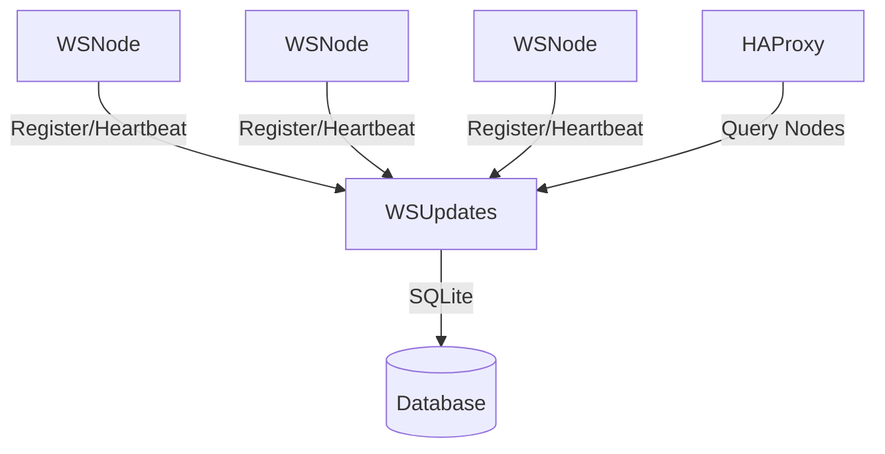

# WSUpdates Node.js Service

Configuration service for WebSocket Management System, built with Node.js and SQLite.

## Architecture



## Features

- Node registration and heartbeat monitoring
- Channel management
- RESTful API with authentication
- SQLite database for persistence
- Docker support
- Logging with Winston

## API Endpoints

### Nodes

- `POST /nodes` - Register a new node
- `GET /nodes` - List all active nodes
- `POST /nodes/:nodeId/heartbeat` - Update node heartbeat

### Channels

- `POST /channels` - Register a new channel
- `GET /nodes/:nodeId/channels` - List all channels for a node

## Development

1. Copy environment file:
   ```bash
   cp .env.example .env
   ```

2. Install dependencies:
   ```bash
   npm install
   ```

3. Start development server:
   ```bash
   npm run dev
   ```

## Docker Deployment

Build and run with Docker:

```bash
docker build -t wsupdates .
docker run -p 8000:8000 -v ws_data:/data wsupdates
```

Or use docker-compose:

```bash
docker-compose up --build
```

## Environment Variables

- `PORT` - Server port (default: 8000)
- `API_KEY` - Authentication key for API access
- `DB_PATH` - SQLite database path
- `LOG_LEVEL` - Logging level (default: info)

## Security

- API key authentication
- Helmet security middleware
- CORS protection
- Input validation

## Testing

Run tests with Jest:

```bash
npm test
```
